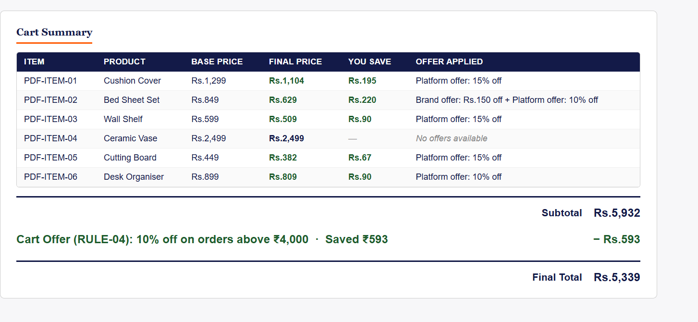
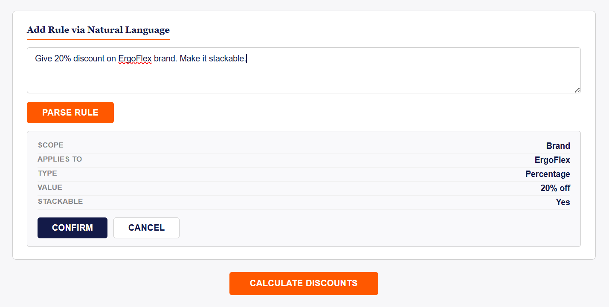
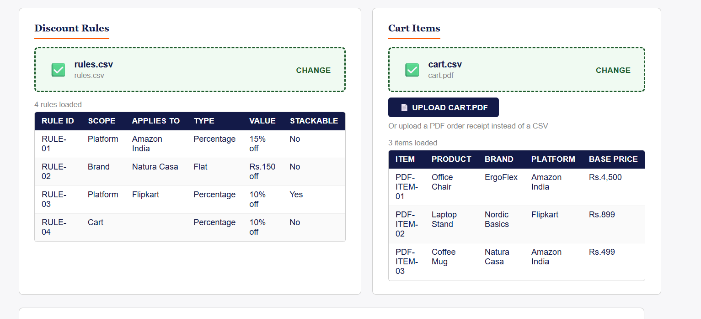
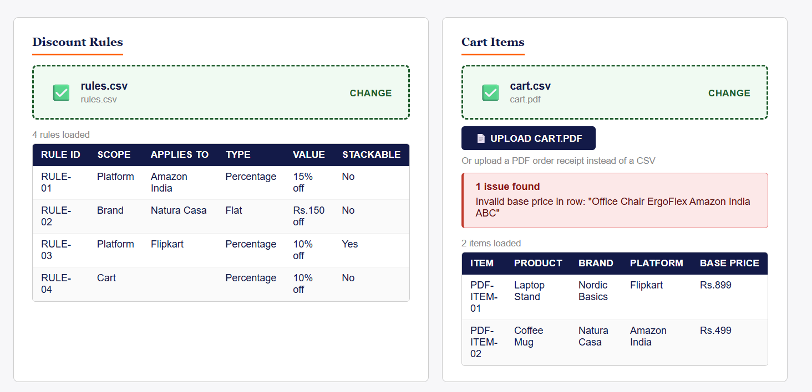

# Opptra Discount Engine

## Overview

The Opptra Discount Engine is a browser-based discount calculation tool built with React and Vite. It allows users to upload discount rules and cart items as CSV files, apply item-level and cart-level discounts, and view a detailed cost breakdown. Users can also add rules through natural language input (powered by the OpenAI API) or upload a PDF order receipt to replace the current cart. All processing happens entirely in the browser with no backend required.

**Live Demo:** https://discount-engine-assignment-iota.vercel.app/

---

## Features

- CSV upload for discount rules
- CSV upload for cart items
- Item-level discount calculation (brand and platform scope)
- Stackable and non-stackable rule handling with best-saving selection
- Cart-level discounts applied after item-level discounts
- Automatic rule validation with row-level error reporting
- Natural language rule creation using the OpenAI API
- PDF cart upload — extract cart items from an order receipt PDF and replace the current cart
- Duplicate rule detection before appending new rules
- Automatic cart recalculation when new rules are added
- Error handling for invalid files, ambiguous inputs, and API failures
- Clean, responsive UI consistent with the Opptra design language

---

## Tech Stack

| Layer | Technology |
|---|---|
| UI Framework | React 18 |
| Build Tool | Vite 5 |
| Language | JavaScript (ES Modules) |
| CSV Parsing | PapaParse |
| PDF Extraction | pdfjs-dist |
| AI Rule Parsing | OpenAI API (gpt-4o-mini) |

---

## Project Structure

```
discount-engine-assignment/
├── public/
├── sample-data/
│   ├── cart.csv               # Sample cart input
│   └── rules.csv              # Sample discount rules
├── src/
│   ├── components/
│   │   ├── CsvUploader.jsx    # Reusable CSV file upload component
│   │   ├── DataTable.jsx      # Generic table renderer
│   │   ├── ErrorBanner.jsx    # Validation error display
│   │   ├── PdfRulePreview.jsx # Preview table for PDF-parsed rules
│   │   ├── PdfRuleUploader.jsx# PDF file upload and extraction trigger
│   │   ├── RuleInput.jsx      # Natural language input and parse trigger
│   │   └── RulePreview.jsx    # Preview card for NL-parsed rule
│   ├── engine/
│   │   ├── csvParser.js       # CSV parsing and validation logic
│   │   └── discountEngine.js  # Core discount calculation logic
│   ├── services/
│   │   ├── openai.js          # OpenAI API integration for NL rule parsing
│   │   └── pdfParser.js       # PDF text extraction and rule parsing
│   ├── App.jsx                # Root component, state management
│   ├── main.jsx               # React entry point
│   └── index.css              # Global styles
├── .env                       # Environment variables (not committed)
├── index.html
├── package.json
└── vite.config.js
```

---

## Installation

> **Live deployment:** https://discount-engine-assignment-iota.vercel.app/

To run locally:

```bash
git clone https://github.com/your-org/discount-engine-assignment.git
cd discount-engine-assignment
npm install
npm run dev
```

The application will be available at `http://localhost:5173`.

---

## Environment Variables

Create a `.env` file in the project root before running the application:

```
VITE_OPENAI_API_KEY=your_openai_api_key_here
```

The OpenAI API key is required only for the natural language rule input feature. CSV upload and PDF upload work without it.

---

## Usage

### CSV Workflow

1. Upload `rules.csv` using the **Discount Rules** upload panel.
2. Upload `cart.csv` using the **Cart Items** upload panel.
3. Click **Calculate Discounts** to run the engine.
4. The **Cart Summary** section displays item-level results, subtotal, cart offer (if applicable), and final total.

### Natural Language Rule

1. In the **Add Rule via Natural Language** section, type a rule description in plain English.
2. Click **Parse Rule**. The OpenAI API parses the input and returns a structured preview.
3. Review the preview and click **Confirm** to append the rule and recalculate, or **Cancel** to discard.

### PDF Cart Upload

1. In the **Cart Items** panel, click **Upload cart.pdf**.
2. Upload a PDF order receipt with columns: Product, Brand, Platform, Base Price.
3. The parser extracts all cart items and replaces the current cart automatically.
4. If rules are already loaded, the engine recalculates immediately.
5. Any rows that could not be parsed are reported separately.

---

## Sample Inputs

### rules.csv

```csv
rule_id,scope,applies_to,type,value,stackable,min_cart_value
RULE-01,platform,Amazon India,percentage,15,false,
RULE-02,brand,Natura Casa,flat,150,false,
RULE-03,platform,Flipkart,percentage,10,true,
RULE-04,cart,,percentage,10,false,4000
```

### cart.csv

```csv
item_id,product,brand,platform,base_price
ITEM-01,Cushion Cover,Natura Casa,Amazon India,1299
ITEM-02,Bed Sheet Set,Natura Casa,Flipkart,849
ITEM-03,Wall Shelf,Nordic Basics,Amazon India,599
```

---

## Natural Language Rule Examples

```
20% off Natura Casa
15% off Amazon India
Flat Rs.100 off Flipkart
10% off cart above Rs.4000
5% stackable discount for Myntra
Rs.200 flat discount on all Meesho items, stackable
```

---

## PDF Cart Support

The PDF cart uploader extracts cart items from an order receipt PDF. The expected structure is a table with columns: **Product, Brand, Platform, Base Price**.

**Example PDF format:**
```
Order #OP-9921 | Date: 15 Jan 2025

Product          Brand           Platform       Base Price
────────────────────────────────────────────────────────
Cushion Cover    Natura Casa     Amazon India   Rs.1,299
Bed Sheet Set    Natura Casa     Flipkart       Rs.849
Wall Shelf       LivSpace Pro    Amazon India   Rs.599
Ceramic Vase     LivSpace Pro    Noon           Rs.2,499
Cutting Board    Nordic Basics   Amazon India   Rs.449
Desk Organiser   Nordic Basics   Flipkart       Rs.899
```

Uploading a valid cart PDF replaces the current cart immediately. If rules are already loaded, the discount engine recalculates automatically. Rows that cannot be parsed are reported but do not block valid items from loading.

---

## Assumptions

- Percentage discounts are applied to the current running price, not the original base price, which matters when stackable rules are chained.
- When multiple non-stackable rules match an item, the one producing the highest rupee saving is selected; the rest are skipped.
- Stackable rules are applied sequentially after the winning non-stackable rule.
- Cart-level discounts are applied to the subtotal (sum of all item final prices) after all item-level discounts have been applied.
- When multiple cart rules are eligible, the one producing the highest absolute saving is selected.
- Rules added via natural language or PDF are assigned generated IDs (`NL-<timestamp>` and `PDF-<timestamp>-<index>`) and behave identically to CSV-loaded rules.
- Duplicate detection is case-insensitive and whitespace-normalised.

---

## Future Improvements

- Drag-and-drop file upload for CSV and PDF inputs
- OCR support for scanned or image-based PDFs
- User authentication and per-user rule sets
- Database persistence for rules and cart history
- Audit history showing which rules were applied per session
- Export discounted cart as CSV or PDF
- Rule priority and conflict resolution UI
- Support for date-range and quantity-based discount conditions

---

## Screenshots

### Cart Summary


### Natural Language Rule Parsing


### PDF Cart Upload


### Error Handling


---

## Author

**Atharva K A**
